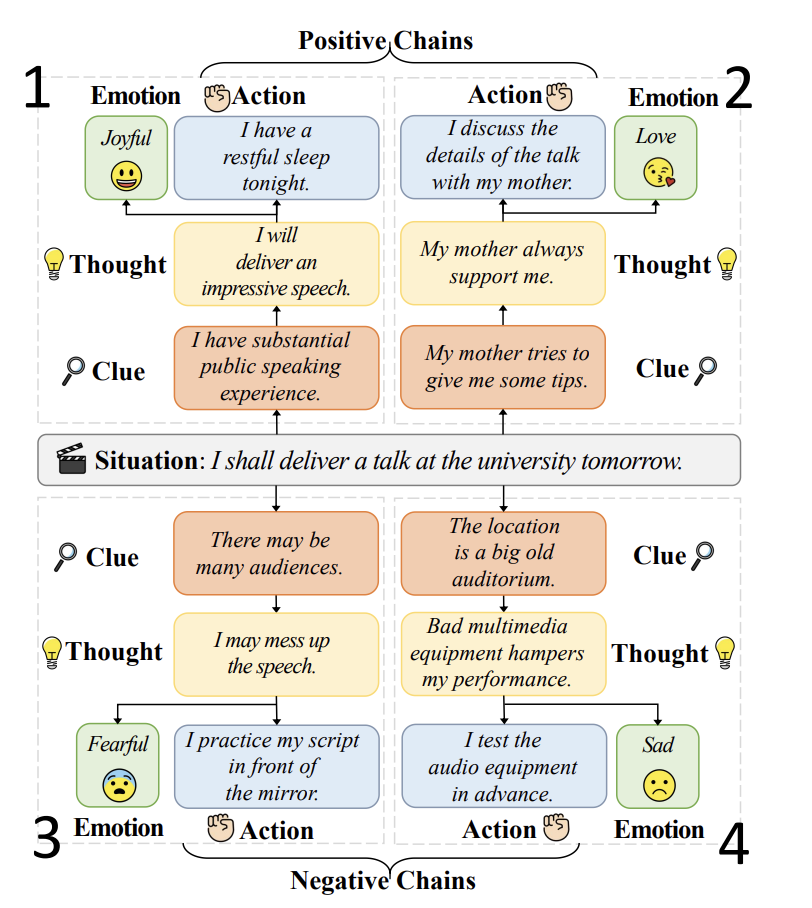
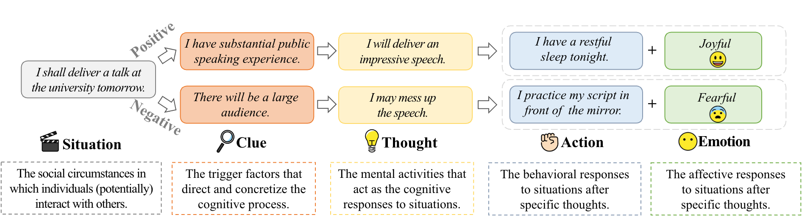
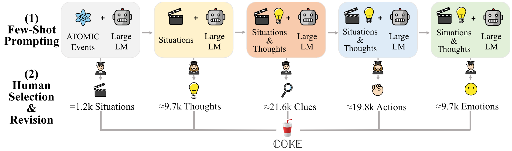
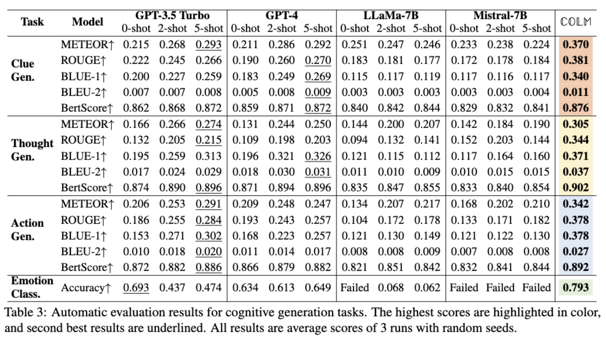
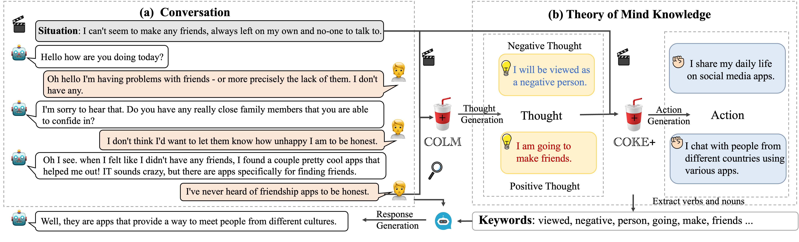
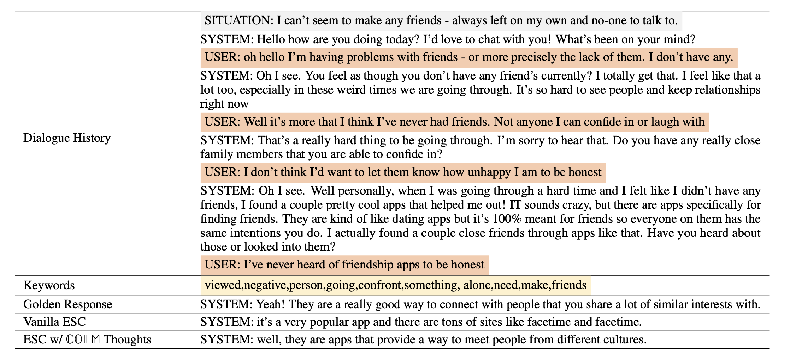

# COKE: A Cognitive Knowledge Graph for Machine Theory of Mind

We will release COKE as soon as possible. 💪

Star this repo to receive the latest notifications. 🙌

## Hola! Welcome to the official repository for **COKE**! 

## What is Theory of Mind?

Theory of mind (ToM) refers to humans' ability to understand and infer the desires, beliefs, and intentions of others. The acquisition of ToM plays a key role in humans' social cognition and interpersonal relations. ToM is still lacking for modern AI and NLP systems since they cannot access the human mental state and cognitive process beneath the training corpus.

## COKE 

  

To empower AI systems with the ToM ability and narrow the gap between them and humans,
✅ We propose COKE: the first cognitive knowledge graph for machine theory of mind. 
   Specifically, COKE formalizes ToM as a collection of 45k+ manually verified cognitive chains that characterize human mental activities and subsequent behavioral responses and affective responses when facing specific social circumstances. 
✅ We build a powerful cognitive language model COLM by associating COKE with LLaMA-2, so as to predict cognitive chains for out-of-KG situations. 

✅ We conduct extensive experiments to evaluate the ToM ability of COLM and typical LLMs. 
   The results show that COLM outperforms strong baseline models such as GPT-4 in both zero-shot and few-shot settings , proved by automatic and human evaluations in all cognitive generation tasks, which in turn demonstrates the high quality of COKE. 
✅ We further substantiate the potential of COKE in enhancing social applications and prove its effectiveness on downstream emotional support conversation tasks .

## Data Structure of COKE

  

## Data Collection

  

## Experiment

  

  

## Downstream Task

### Emotional Support Conversation
The prime objective of ESC is to generate empathetic and effective responses in social dialogues, with the aim of mitigating users’ emotional distress and fostering improved mental states.

  

### Case Study

  

